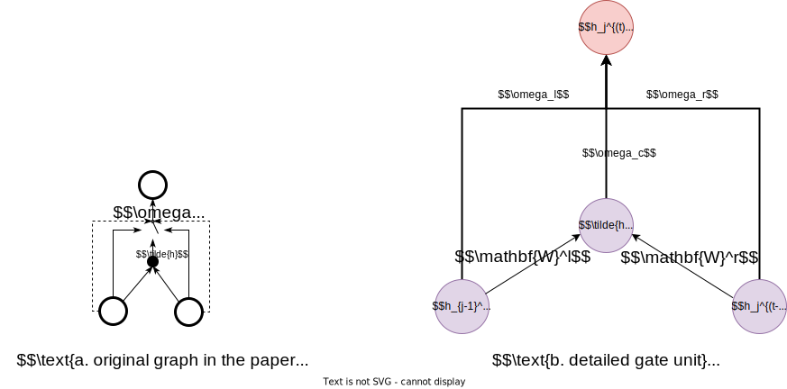
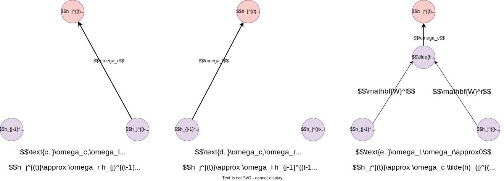
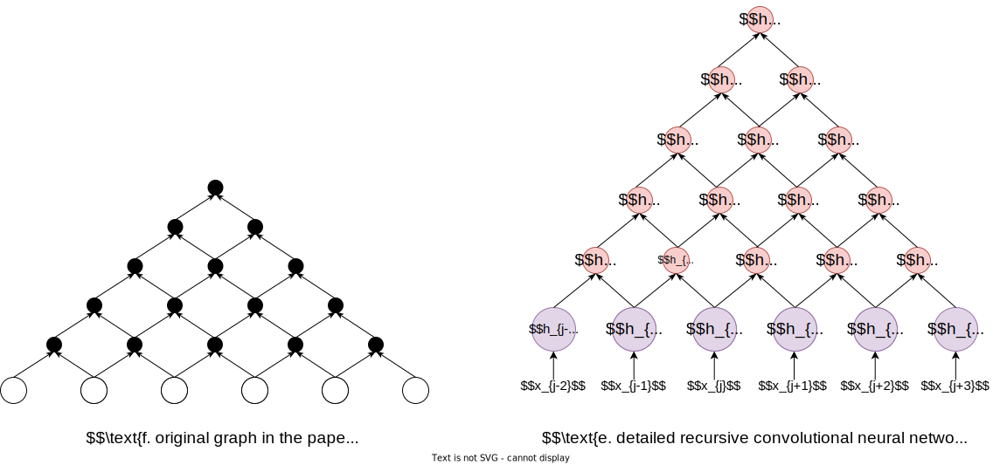
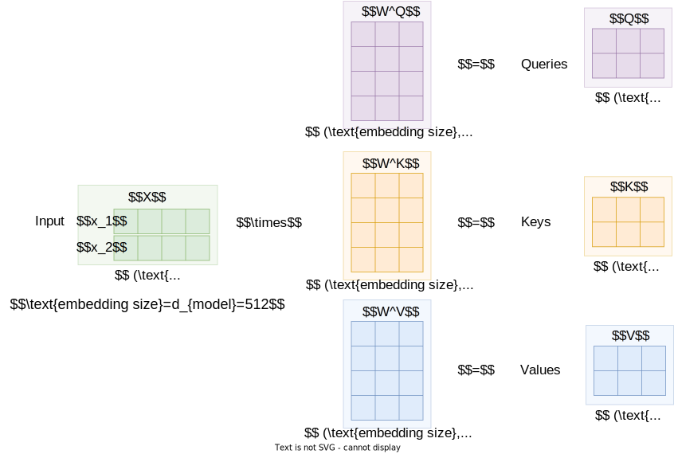
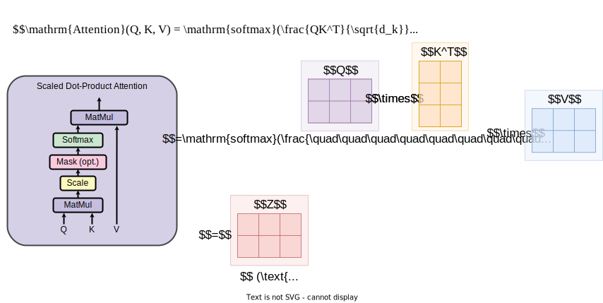
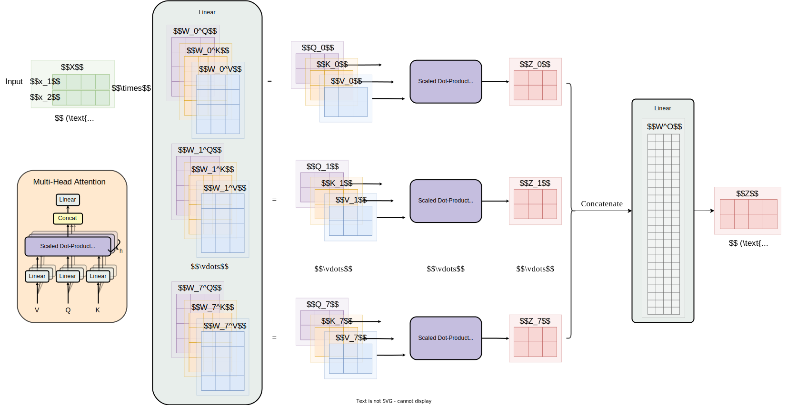

# README

`2023-春季-深度学习基础-计科` / `2023-Spring-DL_fundamentals-CS` 课程布置的任务作业，一共有五次平时作业

- 最后一次大作业见这里：[donglinkang2021/R50_FPN_SSD: My final assignment of deep learning course in BIT (github.com)](https://github.com/donglinkang2021/R50_FPN_SSD)

## 简单介绍

文件目录如下：

```shell
    目录: D:\Desktop2\DL_Foundation\assignment\deep-learning-fundamentals


Mode                 LastWriteTime         Length Name
----                 -------------         ------ ----
d-----         2023/7/15     14:23                work01
d-----         2023/7/15     14:35                work02
d-----         2023/7/15     14:35                work03
d-----         2023/7/15     14:37                work04
d-----         2023/7/15     14:45                work05
-a----         2023/7/15     14:35            146 README.md
```

其中每个work文件夹里面的`README`包含作业的要求和自己在完成作业之后对工作的说明，下面简单介绍一下每次任务的工作。

### work01

就是李沐的d2l中的比赛：用线性回归的方法预测房价，自己的工作如下：

- 使用pytorch写了几个简单的mlp测试，使用numpy从零开始设计网络，不调用`torch.nn`里面的东西
- 测试了batchnorm、dropout这种技术在小网络上的性能（效果并不好）
- 在隐含层的层数(要一层隐含层还是两层还是不要)，优化器（Adam还是SGD）的选取，激活函数（Sigmoid或者relu）的选取方面分别做了测试，最后决定采用一层隐含层+`Adam`+`relu`

### work02

读ResNet和VGG的论文，并给官网上的源码做注释，用了drawio画了一些图来帮助自己理解文章

| model  | basic block                                                  | bottleneck                                                   | conv layer                                        |
| ------ | ------------------------------------------------------------ | ------------------------------------------------------------ | ------------------------------------------------- |
| ResNet |  |  |  |

### work03

CIFAR-10 图像分类任务，自己的工作如下：

- 手写了线性分类器、LeNet、AlexNet来进行训练，本地CPU训练+colab GPU训练，没有做数据增强；
- 使用预训练模型来进行迁移学习、微调，利用VGG16、ResNet18、ResNet50等预训练模型来重写最后的分类器，微调，这里全部做了数据增强；
- 用到了torchvision中的model库和transform库，还有sklearn中的k-fold训练技术

### work04

读Bengio的论文，说的是门控递归卷积神经网络，GRU在这篇文章之后提出，Bengio同一时期的其它文章好像出现了attention的概念，同样用了drawio画了一些图来帮助自己理解文章

| To Understand Gated recursive convolutional neural network |
| :--------------------------------------------------------: |
|                               |
|                           |
|                           |

### work05

读Attention Is All You Need，调用了huggingface上的预训练transformer来使用（GPT2），还是画了一些图👇

> 真正体会啥叫照猫画虎

|                          Attention👇                          |         Scaled Dot-Product Attention👇         |
| :----------------------------------------------------------: | :-------------------------------------------: |
|                   |      |
|                  **Multi-Head Attention**👇                   |               **transformer**👇                |
|  |  |


