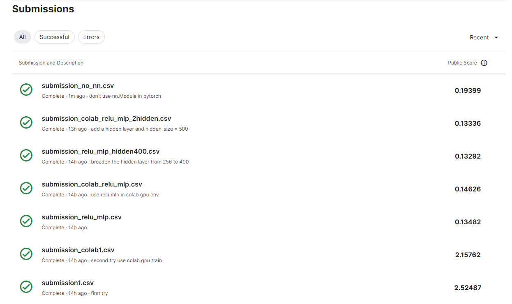

# README

#### **结果**




#### **提交文件说明**

```shell
D:.
│  README.md
│  submission3.png
│  Work01_kaggle_house_prise.ipynb
│
└─其它
        Model.py
        nndemo_test_linear_.ipynb
        nndemo_test_mlp.ipynb
        nonn_demo_test_mlp.ipynb
        nonn_demo_test_optimizer.ipynb
        submission1.png
        submission2.png
        Trainer.py

```

- `Work01_kaggle_house_prise.ipynb`是所部署的最终代码，没有使用`nn.Module`，使用了`sklearn`的`KFold`和文档中建议的损失函数，不过在训练的时候实际使用的是（带根号的最后评测模型效果才使用）：
  $$
  \frac{1}{n}\sum_{i=1}^n\left(\log y_i -\log \hat{y}_i\right)^2
  $$

- `submission3.png`为最终提交结果截图

- `nndemo_test_linear_.ipynb`和`nndemo_test_mlp.ipynb`是自己用`nn.Module`看哪种模型优越的时候写的，最后选定用多层感知机，激活函数的使用`relu`，在截图中可以看到 用了`relu`的mlp比之前的用`sigmoid`的mlp分数一下子高起来了

- `Model.py`和`Trainer.py`是自己写的方便调试模型和训练可视化的两个文件，最后提交的结果没有使用这两个文件；

- `nonn_demo_test_mlp.ipynb`就是没有使用`nn.Module`的小demo，最后提交文件中的代码也是从这里迁移过去的

- `nonn_demo_test_optimizer.ipynb`是自己在重写优化器时的文件，但发现简单例子上`adam`并不见得会比`sgd`优，所以最后没有采用`adam`

> 另外，在我的机器上，batch_size调成16似乎是最漂亮的结果了。。。。。。

#### 原创作者

董林康

#### 完成时间

2023.3.6