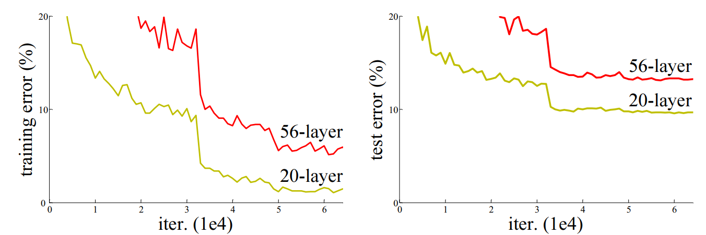

# ResNet读书笔记

[[1512.03385\] Deep Residual Learning for Image Recognition (arxiv.org)](https://arxiv.org/abs/1512.03385)

> Deeper neural networks are more difficult to train.

ResNet提出了一种残差学习的方法，就是为了解决开头所说这个问题，越深的网络越难训练。具体来说，该方法通过在VGG这种类型（作者设计了更深的）网络中每两个或三个卷积层添加identity shortcuts的方法，还把设计了一种bottleneck架构的残差块去节约时间成本，使网络可以更好地学习到残差函数（相比于VGG19而言，网络层数更深、参数量更小），最后提高各种任务下的准确率（获得了ImageNet detection，ImageNet localiztion，COCO detection和COCO segmentation的第一名）。

## Q1 论文试图解决什么问题？

该论文的目标是解决深度神经网络的退化问题。

在之前的学习中，人们发现，在深度神经网络中，更深的网络具有更高的训练误差，因此也有更高测试误差（在论文中的表述是这种网络不容易优化，作者把这叫做退化问题），而这违背了更深的网络有更强的表述能力的假设（作者认为它应该有更小的训练和测试误差才对）。该论文提出的深度残差网络可以使得层数更深的情况下仍然能够更容易地去优化、而且训练出来的测试误差也比浅层的网络要小，从而可以训练出高效的网络，有效地解决了深度神经网络的退化问题（后面作者在CIFAR10数据集上探索的1000层的网络，依然可以看出很好的解决了退化的问题）。

## Q2 这是否是一个新的问题？

深度神经网络中的退化问题是一个新问题。

深层网络其它问题已经很多模型都在解决了：在VGG网络中，作者采用了$3 \times 3$小卷积核、小步幅、更深层网络来获得很好的19层深层网络的效果；而GoogleNet通过采用inception模块，将网络分割成了多个子路径，增加了网络的宽度从而达到深层网络的效果；初始参数归一化和中间归一化、批归一化（Batch Normalization）等等也都解决了深度网络中的梯度消失和梯度爆炸的问题……但是在本论文之前还没有人去专门提出并验证解决这个深度神经网络的退化问题。

这在本论文之前，只有何恺明（本论文作者）在另一篇论文（Convolutional neural networks at constrained time cost. In CVPR, 2015）和Highway networks这篇论文中就已经报告了这一问题，但在本篇论文中才得到了验证。而Highway networks中则已经运用了快捷连接（shortcut connection）的方式来训练深层的网络，但在本论文中，才更加系统地去进行残差学习的阐述，也用实验充分验证了残差网络可以在训练层数更深的网络（或者可以说是超级深的网络）的情况下，仍然可以很好的解决退化的问题。

## Q3 这篇文章要验证一个什么科学假设？

该论文在3.1节提出了后面用实验验证的假设，即深度神经网络的原始映射通常应该易于学习。

> 这里自己的想法就是一旦我们学习出来的网络参数是不好的，通过残差学习我们就可以通过把网络参数去掉（让他们都接近于零）而只保留恒等映射部分（用数学公式表达就是$H(X) = X, \text{if}\; F(X) = 0$），这样做的目的就是希望能重构学习效果，因为作者他们想的一个问题就是越深的网络他们的误差肯定应该是越小才对的，因为可以拟合更复杂的特征，但是不排除模型本身的特征就非常简单，所以我们得多加一个选项就是恒等映射（通俗的话来解释：学得很累的时候，实在不行我就不学了、背书本上的内容就好，可能就这个意思，但这不是一个科学假设）

如果求解器中的很多非线性变换层很难学习到恒等映射（identity mappings）时，那么这些非线性层至少应该能够保证不损害原始映射的效果（即应该能够将这些非线性层的参数置零），否则网络将会退化（即网络越深的误差就会越大）。基于这个假设，作者设计了残差块，通过直接连接输入和输出，保证了网络对恒等映射的可学习性，从而解决了深度神经网络中常常出现的退化问题。

## Q4 有哪些相关研究？如何归类？谁是这一课题在领域内值得关注的研究员？

相关研究可以分成两类，一是在神经网络的各种特征（深度、宽度）下加以研究一提高网络性能，二是解决对某一特征的最前沿的探索，本文章属于后者，为了解决在神经网络在深度特征下的退化问题。

对于前一种研究，在本文中的ImageNet Classification部分已经介绍了，作者使用了VGG和GoogLeNet这两个ILSVRC 2014年最优秀的两个卷积神经网络作为比较对象。VGG网络通过采用小的卷积核和深层的网络，提高了网络的性能，而GoogLeNet引入了inception模块，增加了网络的宽度，都使得网络更加高效且有效的解决了深度神经网络的识别准确率或者难训练等等问题。VGG的作者Simonyan和Zisserman都是值得我们关注的研究员。

而对于后一种研究，该论文的作者何恺明、Srivastava、黄高都是在这一课题内值得关注的研究员，特别是何恺明。他的代表性工作包括ResNet，还有Kaiming初始化（网络参数），这些工作都针对深度神经网络中存在的问题提出了解决方案；而Srivastava所提出的Highway network中的shortcut connection给ResNet提供了很多的idea；黄高则是DenseNet的作者，通过网络层之间添加密集的连接从而达到更好解决深度神经网络的退化问题；

## Q5 论文中提到的解决方案之关键是什么？

该论文提出了的解决方案的关键有以下两点（但觉得下面的图更能说明问题）：

- 恒等映射（Identity Shortcuts）。在论文中的4.1节提出的两种shortcut的方法，恒等映射或者投影映射（Identity vs. Projection Shortcuts），论文在这里也提出了三种方法来将前面层的输入直接加到残差块的输出中去，但论文也说了投影映射的方法并不是解决退化问题的关键（因为作者做了实验证明用A.恒等映射、B.多出来的维度用投影映射、C.只用投影映射这三者的效果实际上差不多），但由于后面会采用瓶颈架构的残差块设计所以用恒等映射会更加简单；
- 瓶颈架构（Bottleneck Architectures）。在上图的右边网络模型中就是采用了bottleneck的这种网络结构设计，原论文中说是因为在更深层次网络（比如50到152层这种网络）考虑到训练时间的影响，但更多的，作者在脚注部分也写了这是为了加深网络的深度（而不产生多余的时间成本，增加深度意味着可以提高网络的精度）而做的一个经济实惠（economical）的操作，而在前面所提到的没有引进多余参数的恒等映射也为瓶颈设计提供了更有效的效果。

> 感觉这一部分有点像VGG中的采用小卷积核就得使用更深层次网络的原理一样，恒等映射和瓶颈架构映射相得益彰。

## Q6 论文中的实验是如何设计的？

实验设计包括以下几个方面：

1. 数据集：论文使用了 ImageNet 和CIFAR-10的数据集，其中ImageNet的数据集和VGG原论文中采用的数据集一致包括 1000 个类别的图像，训练集包括约 1.3M张图像，用验证集约 50K张图像作为测试集来评估；CIFAR-10数据集中有50K张训练集图片，10K张测试集图片。
2. 网络结构：在ImageNet分类任务中，论文使用的深度残差网络 ResNet，包括 18 层、34 层、50 层、101 层和 152 层等多个版本。其中，18 层和 34 层的 ResNet 模型采用基本块（basic block）结构，50 层以上的模型采用瓶颈块（bottleneck block）结构。论文首先评估了18 层和 34 层的普通网络（Plain Networks）和残差网络（Residual Networks）的效果；再进一步评估34 层、50 层、101 层和 152 层的模型在ImageNet上的效果；在CIFAR-10分类任务中，论文使用了20 层、32层、44层、56 层、110 层和1202层的版本，并训练其训练误差和测试误差。
3. 训练方式：论文采用了随机梯度下降（SGD）算法作为优化器，其中包括初始学习率、动量、权重衰减等超参数。同时，论文也提到了训练时使用的一些技巧，例如学习率衰减、数据增强等，但在两个数据集上作者都没有使用dropout。
4. 测试方式：论文使用了 Top-1 和 Top-5 错误率作为评价指标，其中 Top-1 错误率表示模型预测的类别与真实类别不同的比例，Top-5 错误率表示模型预测的前 5 个类别中不包含真实类别的比例（这个定义和VGG原论文中的评估标准一致）。
5. 对比实验：为了证明 ResNet 的有效性，在 ImageNet 数据集上，论文对比了 ResNet 和 VGG、GoogLeNet 等经典卷积神经网络的性能。在 CIFAR 数据集则是和Highway，FitNet这些网络进行了比较。我们在ResNet上都可以看到最优的结果。

## Q7 用于定量评估的数据集是什么？代码有没有开源？

作者在实验中使用了文使用了 ImageNet 和CIFAR-10的数据集，其中ImageNet的数据集和VGG原论文中采用的数据集一致包括 1000 个类别的图像，训练集包括约 1.3M张图像，用验证集约 50K张图像作为测试集来评估；CIFAR-10数据集中有50K张训练集图片，10K张测试集图片。论文作者已将其代码公开发布在GitHub上，其预训练模型在pytorch上也开源供任何人使用。

> [KaimingHe/deep-residual-networks: Deep Residual Learning for Image Recognition (github.com)](https://github.com/KaimingHe/deep-residual-networks)这是论文源代码。
>
> [KaimingHe/resnet-1k-layers: Deep Residual Networks with 1K Layers (github.com)](https://github.com/KaimingHe/resnet-1k-layers)这是作者本人的仓库，来训练 1000层的网络的执行代码

## Q8 论文中的实验及结果有没有很好地支持需要验证的科学假设？

实验结果表明，采用了残差网络后，深度残差网络在具有更深层数的情况下在目前所有的任务上都表现得更加优越。下面引用原论文的最后一段：

> 基于深度残差网络，我们在ILSVRC＆COCO 2015竞赛中赢得了几个赛道的第一名：ImageNet检测，ImageNet定位，COCO检测和COCO分割。详细信息请参见附录。

这足以说明论文的结果很好地支持了需要验证的科学假设。

## Q9 这篇论文到底有什么贡献？

该论文的贡献主要体现在以下三个方面：

1. 提出了一种新的深度神经网络架构，即深度残差网络。通过使用残差块（包括这种shortcut的三种方式还有bottleneck设计），该论文很好解决了深度神经网络中的退化问题，并使得深度神经网络更容易优化。
2. 在ImageNet和CIFAR-10数据集上进行了大量实验证明了深度残差网络在深度和训练方面的性能。实验结果进一步证明了该架构不仅可以训练更深的网络，并且可以获得比其他深度网络更好的训练效果。
3. 该论文提供了深度残差网络的一个有用的新颖架构。学术和工业界都在深度残差网络上做了很多后续工作，这些工作实际上扩展了残差网络的概念，并进一步提高了深度神经网络的性能。（事实上在之后的GPT模型也使用了残差网络的思想，在GPT中每个transformer模块都有一个残差连接将输入直接连接到输出）

## Q10 下一步呢？有什么工作可以继续深入？

- 可以进一步优化残差的连接（DenseNet做了这个工作）
- 把这个思想用在transformer中（GPT做了这个工作）
- 把这个残差连接的思想试着用在autoEncoder中（没见过有人用过）
- 自己的一些想法：
  - 可不可以把残差连接的思想同样用于处理序列的网络中，比如在多个lstm层中加入残差连接，这样能否获得更好的记忆的网络