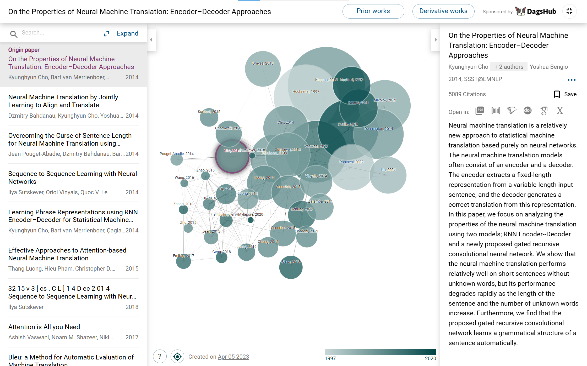
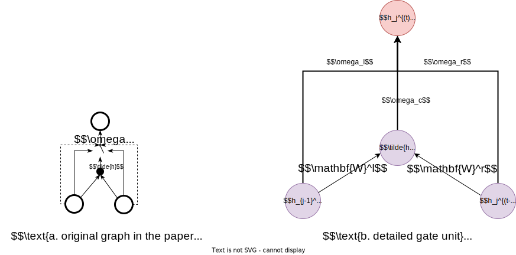
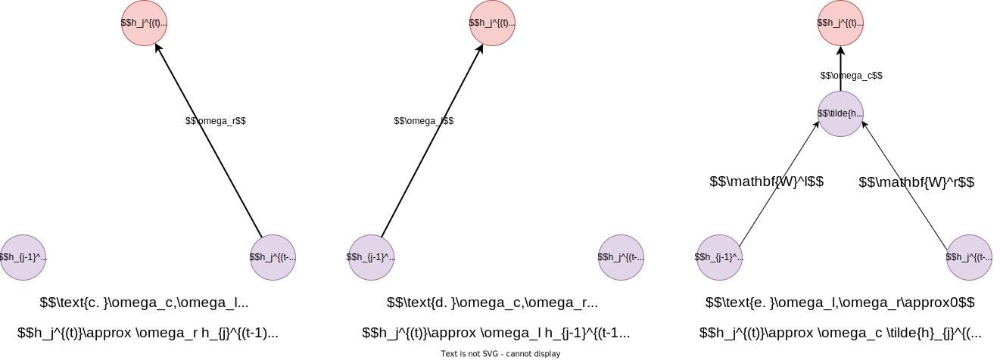
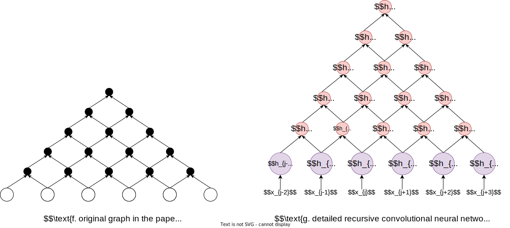
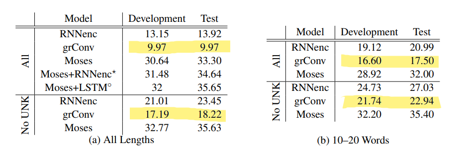
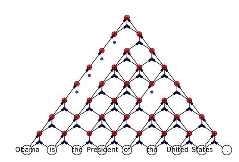

# GRU读书笔记

论文地址：https://arxiv.org/abs/1409.1259

## Q1 论文试图解决什么问题？

该论文试图探讨神经机器翻译（NMT）中编码器-解码器（Encoder-Decoder）架构的性质（具体而言就是在翻译长短句子任务上的不同架构的表现），以及他们所提出的一种能够自动学习句子的语法结构的门控递归卷积神经网络（这篇论文中所提及的gated recursive convolutional network不是GRU，而在2014年12月的[这篇论文](https://arxiv.org/abs/1412.3555)中提及的这个才是**GRU**）

## Q2 这是否是一个新的问题？

在2014年之前也有了很多机器翻译的研究，但在该论文发表的时间（2014年），NMT还是一个相对比较新的领域，而且在Encoder–Decoder的方法上提出这样一种门控递归卷积的神经网络用来学习句子的语法结构并取得不错表现，所以可以认为这是一个新问题。

>  GRU的原始模型，在后面的[文章](https://arxiv.org/abs/1412.3555)中作者更详细的比较了LSTM和GRU的优缺点同样也是新问题。

## Q3 这篇文章要验证一个什么科学假设？

这篇文章是为了给后面提出GRU的工作做准备的，比如探讨在哪些句子上使用门控递归卷积神经网络会表现得更好、源和目标词汇的选择将如何影响翻译的效果、神经机器翻译在哪些情况下会失效（甚至不如之前的传统机器翻译），这篇文章的工作是为了了解这种新架构神经机器翻译的优缺点，严格来说不是为了验证某一个科学假设（文章中也没有明确说明自己的科学假设是说明）。

> 虽然没有明确的科学假设要验证，在实验结果验证了提出的门控递归卷积神经网络是有效的，编码器-解码器架构在NMT中是一种有效的方法，而且提出的架构也确实可以学习到语法结构。

## Q4 有哪些相关研究？如何归类？谁是这一课题在领域内值得关注的研究员？

在这篇文章之前已经有比较多的相关研究了（上图是connectedpapers.com上的生成的相关论文的图），我们根据上面的查询结果以及本论文的引用文献可以这样归类：

### **评估方法**

在评估机器翻译的效果方面有过下面这些相关研究：

- [bleu.dvi (acm.org)](https://dl.acm.org/doi/pdf/10.3115/1073083.1073135)早在2002年就提出的评估机器翻译效果的方法
- [song13deconstructed.pdf (shef.ac.uk)](http://staffwww.dcs.shef.ac.uk/people/X.Song/song13deconstructed.pdf#:~:text=Abstract.BLEU is the de facto standard automatic evaluation,over to a system tuned for our newmetric.)本论文所引用的论文之一，在bleu的基础上更好的评估机器翻译的方法

### **RNN架构**

在网络的结构方面，我们按照时间顺序有下面系列相关研究，但可以发现其实都是在2014年6月至9月发布的：

- [[1308.0850\] Generating Sequences With Recurrent Neural Networks (arxiv.org)](https://arxiv.org/abs/1308.0850)rnn在生成序列方面的研究；
- [[1406.1078\] Learning Phrase Representations using RNN Encoder-Decoder for Statistical Machine Translation (arxiv.org)](https://arxiv.org/abs/1406.1078)，使用rnn的编码器译码器来做的传统机器翻译，在我们读的这篇论文中就是用的rnn的编码器译码器来做的神经机器翻译，但总体来说感觉大部分都是借鉴于这篇文章的（两篇论文中有些图和公式都是一样的），就是在他们的基础上提出了一个门控递归卷积网络。
- [[1409.3215\] Sequence to Sequence Learning with Neural Networks (arxiv.org)](https://arxiv.org/abs/1409.3215)，同样也是在英法任务上做的评估，不过这篇文章使用的架构是LSTM，在后来的[文章](https://arxiv.org/abs/1412.3555)中会和本论文之后的模型GRU一起比较。

### **神经机器翻译**

- [[1409.0473\] Neural Machine Translation by Jointly Learning to Align and Translate (arxiv.org)](https://arxiv.org/abs/1409.0473)和本论文的相关也是非常大的，同样也是在英法翻译任务上做评估，也是基于编码器解码器，这篇文章所提出的对齐方式提升了很多翻译性能。
- [[1409.1257\] Overcoming the Curse of Sentence Length for Neural Machine Translation using Automatic Segmentation (arxiv.org)](https://arxiv.org/abs/1409.1257)本论文是做的短句子，而这篇论文做的是长句子

值得关注的研究员有Dzmitry Bahdanau，Kyunghyun Cho, Yoshua Bengio等，上面这些论文或者相关研究中大部分都是这三个人参与进去的（几乎每篇论文都可以看见Bengio作为最后一位作者），他们的研究都是值得我们关注的；

## Q5 论文中提到的解决方案之关键是什么？

### 门控递归卷积神经网络

该论文的关键之一是提出了一种门控递归卷积神经网络（文章中的例子是二进制的卷积神经网络），用于递归地提取上下文词语的关系从而学习句子的语法结构，这里对原论文中的公式进行逐步解析，

首先我们有一个输入序列

$$
x=(x_1,x_2,\cdots,x_T),\text{其中}x_t\in\mathbb{R}^d
$$

然后在我们的门控递归卷积神经网络中一共有四个权重矩阵$W^l,W^r,G^l,G^r$，其中上标的意思可以理解成left和right，也就是对应左节点和对应右节点的矩阵权重；

对于递归层级$t\in[1,T-1]$，(每一层减少一个节点，到$T-1$层之后就只有一个节点需要输出隐含层提取的信息了)，第j个隐含层单元$h_j^{(t)}$的计算方式是：
$$
h_j^{(t)}=\omega_c \tilde{h}_j^{(t)}+\omega_l h_{j-1}^{(t-1)}+\omega_r h_j^{(t-1)}
$$
其中$\omega_c,\omega_l,\omega_r$在下面会给出具体定义，文章中把它称为gater，我们可以理解为门控权重，而且有$\omega_c+\omega_l+\omega_r=1$，

我们可以将原论文的图进一步详细化如下：

> 其中左图a为原论文的图，右图b是自己结合公式理解画的，可以看到图b与每一个公式的符号都对应了起来，直观一点

在上图b中，$\tilde{h}_j^{(t)} = \phi(\mathbf{W}^lh_{j-1}^{(t-1)}+\mathbf{W}^rh_{j}^{(t-1)})$，其中$\phi$是一个非线性的函数（理解为激活函数），

> 这里注意到原论文的公式表述为$\tilde{h}_j^{(t)} = \phi(\mathbf{W}^lh_{j-1}^{(t)}+\mathbf{W}^rh_{j}^{(t)})$，这里我认为原论文的公式弄错了这一点，因为从上面的图就可以看出实际上应该是上一层递归层的隐含层变量传到下一层，所以激活函数括号内的隐含层的上标应该是$t-1$

其中门控权重 $\omega$ 的计算方式如下：
$$
\left[\begin{array}{c}
\omega_c \\
\omega_l \\
\omega_r
\end{array}\right]=\frac{1}{Z} \exp \left(\mathbf{G}^l h_{j-1}^{(t-1)}+\mathbf{G}^r h_j^{(t-1)}\right)
\\ 
\text{where }Z=\sum_{k=1}^3\left[\exp \left(\mathbf{G}^l h_{j-1}^{(t-1)}+\mathbf{G}^r h_j^{(t-1)}\right)\right]_k
$$
> 上面的公式为了和这里的图对应起来也做了修改，将原论文中的隐状态的上标t改成了t-1

其中 $\mathbf{G}^l, \mathbf{G}^r \in \mathbb{R}^{3 \times d}$ ，用于计算左上下文和右上下文的贡献的权重；$\exp \left(\mathbf{G}^l h_{j-1}^{(t-1)}+\mathbf{G}^r h_j^{(t-1)}\right)$的维度可以这样分析，文章中的隐含层单元$h_j^{(t)}\in \mathbb{R}^{d}$，则有$(3,d) \times (d,) = (3,)$，即$\mathbf{G}^l h_{j-1}^{(t-1)} \in \mathbb{R}^3$,则$\exp \left(\mathbf{G}^l h_{j-1}^{(t-1)}+\mathbf{G}^r h_j^{(t-1)}\right) \in \mathbb{R}^3$,也就是三个数,将这三个数求和便得到了$Z$,通过这样一种方法我们就可以将d维隐含层的张量映射到一个三维（而且三个维度的和为1且都是正数）的向量中，所以就得到了门控权重，而在反向传播过程中，当我们更新参数时就会引起的$\omega_l,\omega_c,\omega_r$的分布发生变化，也就可以调配上下文的重要程度，特别地我们会学习到下面三种情况：

则我们学习到上面c、d、e三种状态。

在原论文中也说明了如何处理第零个递归层的输入数据：
$$
h_j^{(0)} = \mathbf{U}\mathbf{x}_j
$$
在最上面我们提到了$x_t\in\mathbb{R}^d$则我们也可以知道了$\mathbf{U}$的作用其实是将输入序列的一个值投影到隐含层的空间，它的维度就应该是$h \times d$，其中$h$便是隐含层的维度（尽管在上面我们一直默认隐含层的维度为$d$下面我们依然这样采用)，则通过上面推导，我们可以得出下面的门控递归卷积神经网络的图：

文章就是使用了这种权重自动分配的网络结构去学习到了句子的语法结构；

###  Encoder–Decoder

在之前的[论文](https://arxiv.org/abs/1406.1078)中就已经有人做过了SMT的encoder-decoder来将变长的序列编码（用rnn或者lstm来编码）成固定长度的编码，再通过解码器来解码获得可变长度的序列，作者也是采用这种架构来对不太的编码器的表现（第一个模型使用具有门控隐藏单元的RNN作为编码器，第二个模型使用提出的门控递归卷积神经网络（grConv）作为编码器），

## Q6 论文中的实验是如何设计的？

### 模型

实验中使用了编码器-解码器架构，并使用两个模型来测试，第一个模型使用具有门控隐藏单元的RNN作为编码器，第二个模型使用提出的门控递归卷积神经网络（grConv）作为编码器，使用具有门控隐藏单元的RNN作为解码器。

- 使用小批量梯度下降法训练
- 参数初始化
  - RNNenc：谱半径为1的正交矩阵；
  - grConv：谱半径为0.4的正交矩阵。
- 激活函数
  - RNNenc：每个节点使用tanh；
  - grConv：每个节点使用relu。
- 使用束搜索来获得条件概率的翻译，找到前k个最佳翻译时，不使用通常的对数概率，而是使用相对于翻译长度进行归一化的概率。

### 数据集

数据集是关于英法翻译任务的双语平行语料库。这是一组348M个语料，通过(Axelrod等，2011)中的方法从Europarl（61M个单词）、新闻评论（5.5M）、联合国（421M）和两个网络爬取的语料库分别为90M和780M个单词的组合中选择。(没有使用单独的单语数据。)

- NMT的性能是在news-test2012、news-test2013和news-test2014数据集（每个数据集3000行）上衡量的。
- 与SMT系统进行比较时，news-test2012和news-test2013作为调整SMT系统的开发集，将news-test2014作为测试集。

## 定量分析

在定量分析中有几个特征总结如下：

- 在短句子上表现良好
- 随着句子长度的增加，表现显著下降

在上表中标黄的部分是提出来的门控递归卷积神经网络的得分。由上表可以看出，与提出的纯神经机器翻译系统相比，基于短语的SMT系统（Moses）更优越，但我们可以看到，在某些条件下（源语言和参考句子中均没有未知单词），差异减少。此外，如果我们只考虑短句子（每个句子10-20个单词），差异会进一步减小（见表1(b)）。但如果与SMT结合起来使用那么得分就可以进一步提高（见表1(a)）。

## 定性分析

如果不单纯看bleu评分而是看具体的表现的话，论文发现grConv是学习到了句子的结构的（如下图），并觉得这一部分可以进一步研究。

## Q7 用于定量评估的数据集是什么？代码有没有开源？

### 数据集

数据集是关于英法翻译任务的双语平行语料库。这是一组348M个语料，通过(Axelrod等，2011)中的方法从Europarl（61M个单词）、新闻评论（5.5M）、联合国（421M）和两个网络爬取的语料库分别为90M和780M个单词的组合中选择。(没有使用单独的单语数据。)

- NMT的性能是在news-test2012、news-test2013和news-test2014数据集（每个数据集3000行）上衡量的。
- 与SMT系统进行比较时，news-test2012和news-test2013作为调整SMT系统的开发集，将news-test2014作为测试集。

### 代码没有开源

没有在网上找到相关代码（即使在文章脚注有`The code will be available online, should the paper be accepted.`）

## Q8 论文中的实验及结果有没有很好地支持需要验证的科学假设？

实验结果表明，基于grConv的编码器-解码器架构在NMT中值得进一步探究的价值（虽然目前测试的性能不太好），但与传统的SMT结合起来会对于翻译质量和训练效率都有不错的提升效果。而且也探讨了这种结构的一系列特性，探讨在哪些句子上使用门控递归卷积神经网络会表现得更好、源和目标词汇的选择将如何影响翻译的效果、神经机器翻译在哪些情况下会失效（甚至不如之前的传统机器翻译）。从这一角度而言，该论文提出的科学假设得到了很好的验证和支持。

## Q9 这篇论文到底有什么贡献？

该论文研究了一种最近引入的基于纯神经网络的机器翻译系统的特性。并评估两种编码器-解码器方法在句子到句子翻译任务中的性能：（1）带有门控隐藏单元的RNNd的编码器（2）新提出的门控递归卷积神经网络的编码器。最后发现grConv模型可以模仿输入句子的语法结构，不需要对语言的句法结构进行任何监督，为后续的研究打下了基础。

## Q10 下一步呢？有什么工作可以继续深入？

下一步可以做的论文中提了两个点：

首先，找到一种方法来扩展神经网络的训练，无论是在计算还是内存方面，以便可以使用更大的源语言和目标语言词汇表。特别是对于具有丰富形态的语言，需要提出一种完全不同的处理单词的方法。（实际上后面就找到了Transformer的机制）

其次，需要进行更多的研究，以防止神经机器翻译系统在处理长句子时性能下降，需要探索不同针对解码器的神经网络架构。
