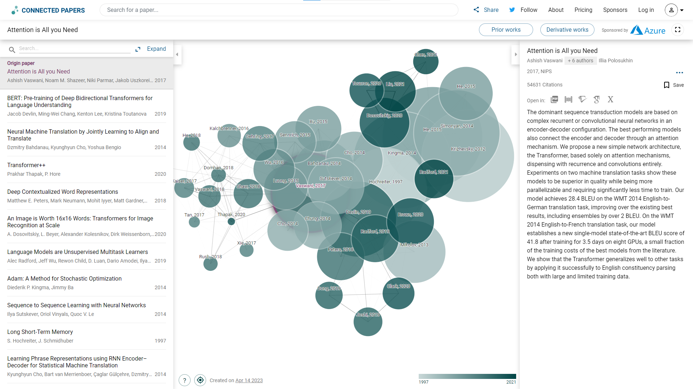
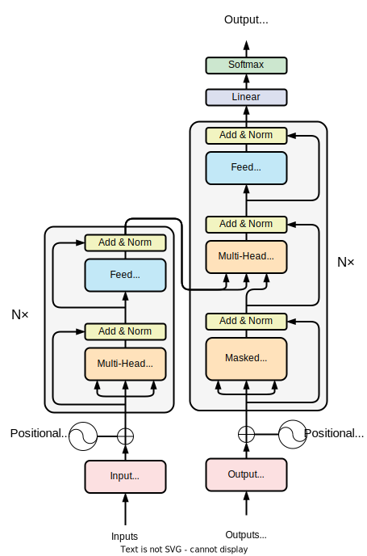
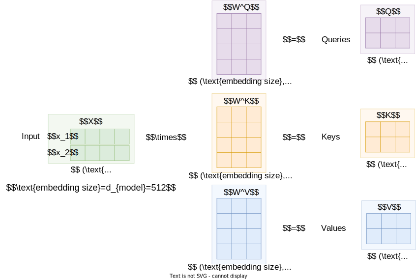
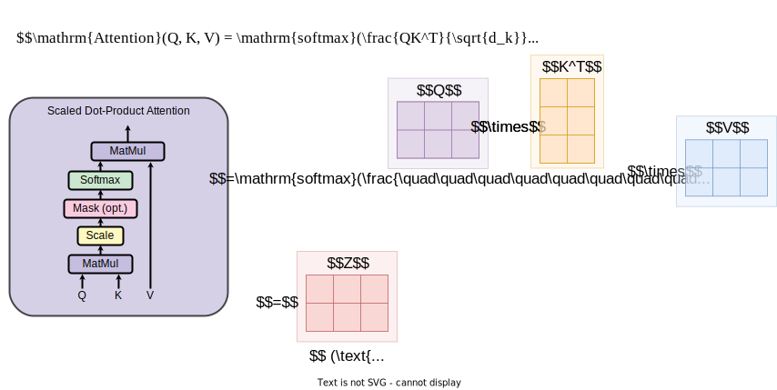
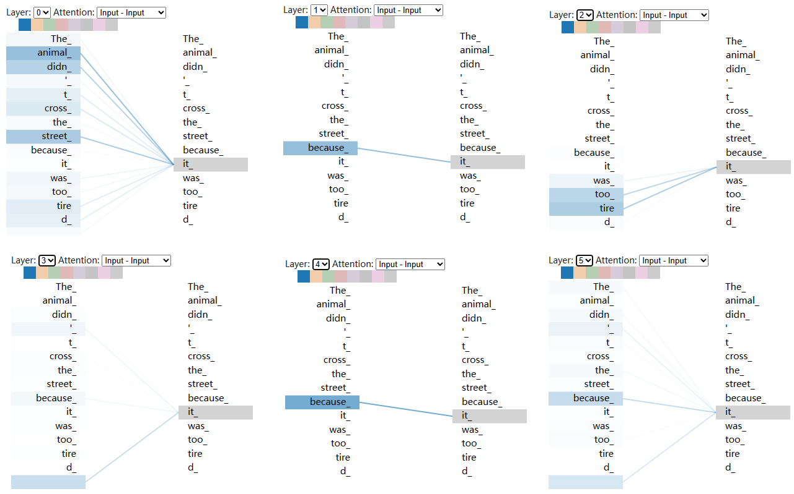
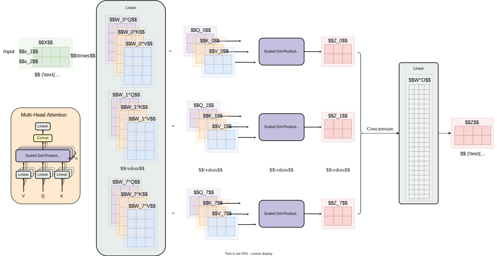
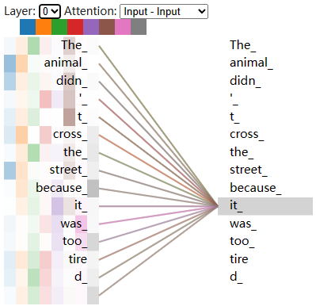
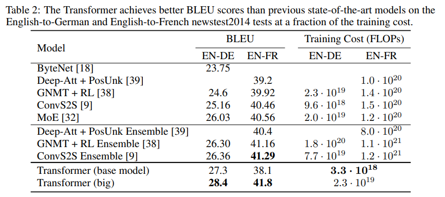

# Transformer读书笔记

论文地址：https://arxiv.org/abs/1706.03762

## Q1 论文试图解决什么问题？

论文试图解决的问题是如何有效地应用深度学习模型来处理自然语言处理序列转换的任务。传统的序列转换模型，如循环神经网络（RNN）和卷积神经网络（CNN），传统的一系列RNN在处理序列时存在着短期记忆和长期依赖的问题，如难以捕捉长距离的依赖关系，因为是顺序计算所以并行计算能力较弱导致训练和推理速度慢等问题。因此，本文提出了一种新的序列转换模型——Transformer模型，摒弃了循环和卷积，用于在NLP任务中进行序列到序列的学习，而且训练时间更少。

## Q2 这是否是一个新的问题？

在NLP领域中，序列到序列的学习一直是一个重要的问题，但在本文发表之前，主要的解决方案是基于RNN或CNN的模型。而在本文章之前，有不少文章也同样提出了一系列减少顺序计算的方法，但它们都是使用卷积神经网络来学习远距离位置之间的依赖关系。而本文提出的Transformer模型摒弃了之前的卷积架构，而且将操作数量降低至常数级别，并用Multi-Head Attention抵消有效分辨率下降的问题，因此可以被视为一种新的解决方案。

## Q3 这篇文章要验证一个什么科学假设？

本文的科学假设总结来说就是仅仅引入自注意力机制就已经够了（即标题Attention Is All You Need）。而实际上文章中也证明了在序列转换以及学习句法结构的任务上都取得了最新、最佳的结果，文章从编码器解码器的架构到自注意力的原理等等设计到实验结果来验证提出的Transformer模型是否可以在不使用RNN或CNN的情况下，在NLP任务中实现序列到序列学习，并且是否比传统的序列转换模型更好。

## Q4 有哪些相关研究？如何归类？谁是这一课题在领域内值得关注的研究员？

我们结合connectedpapers.com上画出相关论文的图的结果和原论文的引用文献来总结归类之前的相关研究：

### 序列建模和转换

- [[1409.3215\] Sequence to Sequence Learning with Neural Networks (arxiv.org)](https://arxiv.org/abs/1409.3215)在英法翻译任务上做的评估，这篇文章使用的架构是LSTM架构
- [[1409.0473\] Neural Machine Translation by Jointly Learning to Align and Translate (arxiv.org)](https://arxiv.org/abs/1409.0473)使用encoder-decoder 并介绍神经机器翻译（NMT）是如何进行对齐的
- [[1406.1078\] Learning Phrase Representations using RNN Encoder-Decoder for Statistical Machine Translation (arxiv.org)](https://arxiv.org/abs/1406.1078)使用RNN的编码器译码器来做的传统机器翻译

### RNN与编码器-解码器

- [[1609.08144\] Google's Neural Machine Translation System: Bridging the Gap between Human and Machine Translation (arxiv.org)](https://arxiv.org/abs/1609.08144)使用深度LSTM网络组成，具有8个编码器层和8个解码器层，使用注意力和残差连接做的WMT'14英法和英德任务。
- [[1508.04025\] Effective Approaches to Attention-based Neural Machine Translation (arxiv.org)](https://arxiv.org/abs/1508.04025)研究了不同注意力方法（全局源单词或局部源单词）的NMT去做WMT英德翻译任务。
- [[1602.02410\] Exploring the Limits of Language Modeling (arxiv.org)](https://arxiv.org/abs/1602.02410)探索了RNNs在语言模型的边界，主要在语料库和词汇表的大小，以及语言的复杂、长期结构方面。

### 循环模型的技巧

- [[1703.10722\] Factorization tricks for LSTM networks (arxiv.org)](https://arxiv.org/abs/1703.10722)介绍了lstm的分解技巧。
- [[1701.06538\] Outrageously Large Neural Networks: The Sparsely-Gated Mixture-of-Experts Layer (arxiv.org)](https://arxiv.org/abs/1701.06538)介绍了条件计算以减少计算成本。

### 注意力机制

- [[1508.04025\] Effective Approaches to Attention-based Neural Machine Translation (arxiv.org)](https://arxiv.org/abs/1508.04025)研究了不同注意力方法（全局源单词或局部源单词）的NMT去做WMT英德翻译任务。
- [[1702.00887v2\] Structured Attention Networks (arxiv.org)](https://arxiv.org/abs/1702.00887v2)扩展了注意力机制的方法：结构化注意力网络
- [[1606.01933\] A Decomposable Attention Model for Natural Language Inference (arxiv.org)](https://arxiv.org/abs/1606.01933)提出了不用RNN的自然语言推理神经架构

### 值得关注的研究人员

- Noam Shazeer 上面的Exploring the limits of language modeling和Outrageously large neural networks: The sparsely-gated mixture-of-experts layer.都是其著作，领域在条件计算和模型的边界方面，同时也是本文的作者；
-  Jakob Uszkoreit 2016年提出的不用rnn的架构A decomposable attention model，领域就是注意力方面，同时也是本文作者之一，本文中提出去除rnn的就是他；
-  Łukasz Kaiser 本文作者之一，负责设计源代码，同时也引用了三篇他的论文：. Can active memory replace attention?和Neural GPUs learn algorithms和Multi-task sequence to sequence learning.，主要领域在gpu、memory、attention等方面；
- Yoshua Bengio 之前的关于RNN、GRU、NMT的一系列文章都是Bengio的学生发的；

## Q5 论文中提到的解决方案之关键是什么？

论文中提到的解决方案的关键是Transformer模型架构中的注意力机制。自注意力机制允许模型在处理序列时同时关注序列中的所有位置（并行计算），而不是像传统的序列转换模型（使用RNNs）那样只关注前面的位置（顺序计算）。因此，注意力机制能够更好地捕捉长距离的依赖关系，从而提高Transformer模型的性能，也能够训练得更加快。除此之外，位置编码也是一个关键点，文章中使用了位置编码的方法让网络学习到了相对位置输入的信息。

下面介绍一下transformer中的主要架构中的两个关键点（架构图如下）：

- 注意力
- 位置编码

### 注意力（attention）

在我们进行最主要的注意力操作之前，我们要先对输入的语言序列的每个单词做tokenize embedding，即将一个句子序列$\mathrm{centence}=[word_1,word_2,\cdots,word_n]$映射到预训练好的词嵌入空间中，由$(n,1)$的
$\mathrm{centence}$我们得到了$(n,\text{embedding size})$的一个输入矩阵$X$（如果在原论文中我们应该把维度称为$(n,d_{model})$，但其实是一样的），这样我们就做好了word token embedding（wte），接着我们对输入矩阵$X$做下面操作分别得到查询$Q$，键$K$和值$V$的矩阵：

#### Scaled Dot-Product Attention

对上面的矩阵做如下操作便可以得到一个注意力矩阵：

对上面操作的理解就是这个操作将原来的一个embedding词经过attention层后重新映射在隐含embedding空间中的位置，或者说是最能代表该embedding词在embedding空间的一个位置，举个例子来说就是thinking 这个词经过一层attention之后给他划分到think的附近的位置，再经过一层attention就划分到更抽象的层次，也可以说是一层attention就是一次抽象，与RNN顺序计算的特点不同，我们可以从上面的图直观看到所有的词嵌入的张量都是同时计算的，也就是文章中所说的并行，这样就可以非常好的学习到了词与词之间的关系，每个词都不同程度上的关系到其他词中去。

可以在下面图中看到不同抽象层的关于it注意力结果

#### Multi-Head Attention

$$
\mathrm{MultiHead}(Q, K, V) = \mathrm{Concat}(\mathrm{head_1}, ...,
\mathrm{head_h})W^O    \\
    \text{where}~\mathrm{head_i} = \mathrm{Attention}(QW^Q_i, KW^K_i, VW^V_i),\\
W^Q_i \in
\mathbb{R}^{d_{\text{model}} \times d_k},
W^K_i \in
\mathbb{R}^{d_{\text{model}} \times d_k},
W^V_i \in
\mathbb{R}^{d_{\text{model}} \times d_v}
$$

多头注意力则学习到了不同语境下不同注意力的关系，原论文中是8个注意头，则相当于是分了八个角度来理解一个词与其它词的关联程度：

可以在下面的图中同样看到不同注意力的理解不一样：

- 在蓝色注意头中it更关注animal和street（直观看到这两个颜色最深）(从代指名词的方面考虑)
- 橙色注意头中关注animal和cross（从代指事件的方面考虑）
- 绿色关注the （从相似词的方面考虑）
- 红色关注cross tired （从代指事件的方面考虑）
- 紫色和粉色关注it was too (更关心周围的词语)
- 棕色关注 the didn't (抽象了一点)
- 灰色关注because too （更关注原因？？）

如果从上面这些角度去理解训练好的模型，我们可以发现transformer中的多头注意力机制就是从多个角度利用现有的其它词语去尝试解释当前词语（即找出其中的联系），而且我们发现网络学习到的结果最后也是可靠的（可解释性比较强），甚至也学习到了我们没有关注的地方（人类难以察觉的地方都被网络学习到了），这也不难说明为什么transformer训练得快、取得成功。

### 位置编码（Position Encoding）

位置编码相较于自注意力可能不显得那么重要，但它在文章中的设置很巧妙的使得网络学习到了输入序列的位置关系，word position encoding(wpe)的核心思想就是对序列中从左到右每个词赋予一个唯一的编码，我们很容易想到one-hot，十进制或者二进制的编码，但这样的缺点就是太浪费空间了，在文章中作者用了一种类似二进制但比二进制更加节省空间的编码方式来和embedding后的词向量相加一同输入网络，从而让网络学习到词语在序列中的位置的信息：
$$
PE_{(pos,2i)} = sin(pos / 10000^{2i/d_{\text{model}}})\\
PE_{(pos,2i+1)} = cos(pos / 10000^{2i/d_{\text{model}}})
$$
下图为Jay Alammar的博客中解释位置编码所画的图，纵坐标为序列中每个词的索引，每一行的意思就代表了一个词的位置编码。 

## Q6 论文中的实验是如何设计的？

### 训练数据和批次

训练数据集：
- 英德数据集：标准的WMT 2014英德数据集，包括约450万个句子对。
- 英法数据集：WMT 2014英法数据集，包括约3600万个句子对，标记拆分为32000个单词块。

编码方式：
- 字节对编码[3]：用于英德数据集的句子编码。
- 单词块[38]：用于英法数据集的句子编码。

批次处理：
- 按大致序列长度分批处理。
- 每个训练批次包含一组句子对，其中包含大约25000个源标记和25000个目标标记。

### 硬件和规划

- 训练设备：一台配备8个NVIDIA P100 GPU的计算机
- 基准模型训练：使用本文中描述的超参数，每个训练步骤大约需要0.4秒。共训练100,000个步骤或12小时。
- 大型模型训练：步骤时间为1.0秒。共训练300,000个步骤（3.5天）。

### 优化器

- 使用Adam优化器[20]。
- β1 = 0.9, β2 = 0.98，$\epsilon$ = 10−9。

学习率：
- 根据公式$lrate = d_{\text{model}}^{-0.5} \cdot  \min({step\_num}^{-0.5},    {step\_num} \cdot {warmup\_steps}^{-1.5})$进行调整。
- 前warmup_steps个训练步骤内，线性增加学习率。
- 后续训练步骤内，学习率按步数的倒数平方根进行比例调整。
- 使用warmup_steps = 4000。

### 正则化

残差丢弃：

- 在每个子层的输出上应用dropout 。
- 在将其添加到子层输入并进行归一化之前应用。
- 在编码器和解码器堆栈中的嵌入和位置编码的总和上应用dropout。 
- 对于基准模型，使用Pdrop = 0.1的丢弃率。

标签平滑：
- 在训练过程中，采用了值为$\epsilon_{ls}$ = 0.1的标签平滑。
- 降低困惑度，因为模型学会更加不确定。
- 提高准确性和BLEU分数。

## Q7 用于定量评估的数据集是什么？代码有没有开源？

### 数据集

在前面进行翻译任务中用于定量评估的数据集采用的是WMT 2014英德和英法翻译任务的数据。

而后面用于英语成分句法分析的数据集则采用的是华尔街日报的数据，还使用了BerkleyParser语料库。

### 代码

代码已经开源，原论文中给出的代码网址是[tensorflow/tensor2tensor: Library of deep learning models and datasets designed to make deep learning more accessible and accelerate ML research. (github.com)](https://github.com/tensorflow/tensor2tensor)

但实际上哈佛的nlp团队用pytorch实现了带注释版代码的论文文章，而且里面也举了一些例子使得更容易理解：

[harvardnlp/annotated-transformer: An annotated implementation of the Transformer paper. (github.com)](https://github.com/harvardnlp/annotated-transformer#readme)

## Q8 论文中的实验及结果有没有很好地支持需要验证的科学假设？

由文章以及上图结果可知在WMT 2014英德翻译任务上：

- 大型Transformer模型（表2中的Transformer（big））表现优于之前报告的最佳模型，BLEU得分超过2.0，确立了新的最先进BLEU得分为28.4。
- 该模型使用8个P100 GPU进行训练，耗时3.5天。
- 基准模型也超过了之前所有已发布的模型和集合，训练成本只是竞争模型的一小部分。

在WMT 2014英法翻译任务上：

- 大型Transformer模型实现了41.0的BLEU得分，优于之前所有已发布的单个模型，在不到之前最先进模型训练成本的1/4的情况下。
- 针对英法翻译训练的Transformer（big）模型使用了丢弃率Pdrop = 0.1，而不是0.3。

实验结果表明，Transformer模型在机器翻译和语言建模任务中的性能都优于其他基于RNN和CNN的模型。这表明Transformer模型可以在不使用RNN和CNN的情况下，实现序列到序列的学习，并且比传统的序列转换模型更好。论文中的实验及结果很好地支持了需要验证的科学假设（Attention is all you need!!!）。

## Q9 这篇论文到底有什么贡献？

本工作的主要贡献：

- 提出了Transformer模型，这是首个完全基于注意力机制的序列转换模型，将编码器-解码器架构中最常用的循环层替换为多头自注意力机制。
- 在翻译任务中，Transformer的训练速度显著提高，并取得了最新的最佳结果。在WMT 2014英德和英法翻译任务中，都取得了最新的最佳结果。
- 为基于注意力机制的模型的未来打下基础，并计划将它们应用于其他任务，如图像、音频和视频。
- 计划将Transformer扩展到涉及文本以外的输入和输出模态的问题，并研究局部、受限制的注意力机制，以有效地处理大量的输入和输出。
- 另一个研究目标是让生成过程更少依赖顺序。

## Q10 下一步呢？有什么工作可以继续深入？

在本文之后，已经有很多研究工作对Transformer模型进行了进一步的改进和扩展。例如，有一些研究工作探索了如何在Transformer模型中引入额外的特征，以提高模型的性能。另外，一些研究工作还探索了如何使用Transformer模型进行多语言翻译和跨语言学习等任务。因此，未来的工作可以继续深入研究Transformer模型及其应用，在性能和应用方面进行更进一步的改进和探索。

这里部分参考了Jay Alammar博客最后的后续工作：

- [Depthwise Separable Convolutions for Neural Machine Translation](https://arxiv.org/abs/1706.03059)
- [One Model To Learn Them All](https://arxiv.org/abs/1706.05137)
- [Discrete Autoencoders for Sequence Models](https://arxiv.org/abs/1801.09797)
- [Generating Wikipedia by Summarizing Long Sequences](https://arxiv.org/abs/1801.10198)
- [Image Transformer](https://arxiv.org/abs/1802.05751)
- [Training Tips for the Transformer Model](https://arxiv.org/abs/1804.00247)
- [Self-Attention with Relative Position Representations](https://arxiv.org/abs/1803.02155)
- [Fast Decoding in Sequence Models using Discrete Latent Variables](https://arxiv.org/abs/1803.03382)
- [Adafactor: Adaptive Learning Rates with Sublinear Memory Cost](https://arxiv.org/abs/1804.04235)

> 注：除了个别提及的图，论文读书笔记中出现的图均为原创。

## reference

- 论文作者之一Łukasz Kaiser写的t2t展示注意力机制的colab代码:https://colab.research.google.com/github/tensorflow/tensor2tensor/blob/master/tensor2tensor/notebooks/hello_t2t.ipynb
  - 以及他简述的视频：[Attention is all you need; Attentional Neural Network Models | Łukasz Kaiser | Masterclass - YouTube](https://www.youtube.com/watch?v=rBCqOTEfxvg&ab_channel=PiSchool)

- Jay Alammar的解释Transformer的原博客[The Illustrated Transformer – Jay Alammar – Visualizing machine learning one concept at a time. (jalammar.github.io)](https://jalammar.github.io/illustrated-transformer/)
  - 以及他的视频：[The Narrated Transformer Language Model - YouTube](https://www.youtube.com/watch?v=-QH8fRhqFHM&ab_channel=JayAlammar)
  - 以及他的中文翻译博客（翻译的比较好的一篇，链接是在Jay Alammar中的博客中给出的）：[(237条消息) 图解transformer | The Illustrated Transformer_Ann's Blog的博客-CSDN博客](https://blog.csdn.net/qq_36667170/article/details/124359818)

- 哈佛大学nlp团队做的带注释的原论文[The Annotated Transformer (harvard.edu)](http://nlp.seas.harvard.edu/2018/04/03/attention.html)
- position encoding 的理解[Transformer Architecture: The Positional Encoding - Amirhossein Kazemnejad's Blog](https://kazemnejad.com/blog/transformer_architecture_positional_encoding/)
  - 以及他的中文翻译：[(237条消息) Transformer 结构详解：位置编码 | Transformer Architecture: The Positional Encoding_Ann's Blog的博客-CSDN博客](https://blog.csdn.net/qq_36667170/article/details/124336971)

